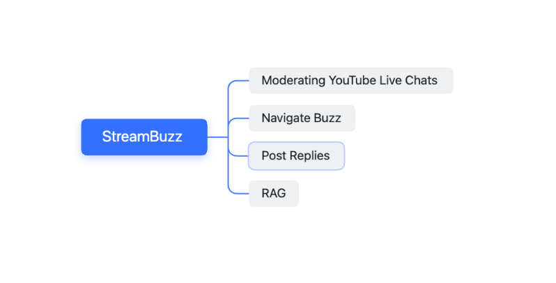
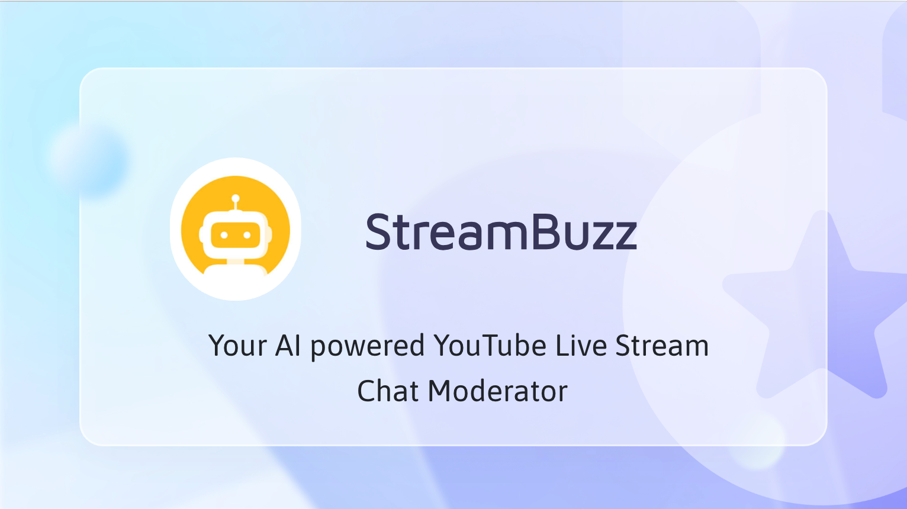
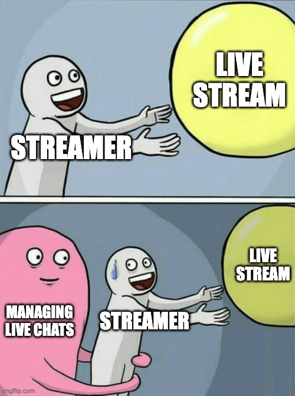

# StreamBuzz 🚀

---

## Hackathon Community Voting

1. 🌟 **Visit Live Agent Studio** to explore [StreamBuzz](https://studio.ottomator.ai/agent/streambuzz) and a ton of other incredible agents!
2. 🎬 **Try out StreamBuzz**! Before diving in, please check out the [usage](#usage) section for the best experience, or simply watch the [demo video](https://youtu.be/7PgvglcWNNA) to get a quick overview.
3. ✅ **Cast your vote** for your favorite agents—I'm hoping that StreamBuzz is one of them! 🤩
4. 🤗 **Thank you so much** for your support! Your vote means a lot.

---

## **Index**

1. [Intro](#your-ai-powered-youtube-live-stream-chat-moderator)
2. [Why StreamBuzz?](#why-streambuzz)
   - [The Solution](#the-solution)
   - [Usage](#usage)
   - [Benefits](#benefits)
   - [Features](#features)
3. [Getting Started](#getting-started)
   - [Installation](#installation)
     - [Configuration](#configuration)
     - [Running StreamBuzz](#running-streambuzz)
4. [Demo & Architecture](#demo--architecture)
   - [Demo Gallery](#demo-gallery)
     - [Images](#images)
     - [Videos](#videos)
     - [Architecture Diagrams](#architecture-diagrams)
5. [Project Nuances and Future Scope](#project-nuances-and-future-scope)
   - [Current Limitations](#current-limitations)
   - [Future Scope](#future-scope)
6. [Acknowledgments](#acknowledgments-)

---

## **Your AI-powered YouTube Live Stream Chat Moderator**

**Attention Streamers!!**

Tired of drowning in a tsunami of chat messages while trying to present to your audience? StreamBuzz to the rescue! This AI sidekick filters key messages, handles FAQs, and posts replies—so you can focus on being the rockstar streamer you were born to be.

---

## **Why StreamBuzz?**

Live streaming is booming, with over **2 billion monthly YouTube users**. Streamers educate, entertain, and engage, but juggling an avalanche of chat messages **while presenting** is like trying to play chess on a roller coaster. 🎢 Important questions, concerns, and requests get lost in the flood, making chat management feel impossible.

### **The Solution**

StreamBuzz **filters the noise, highlights key messages, and automates replies**, so you can engage without stress. No more hunting through chat chaos—just smooth sailing! ⛵

  

**StreamBuzz Feature Map**

  

<b>Click the thumbnail to watch the demo on YouTube! 🚀</b>

---

### **Meme Break!** 😆

  

---

### **Usage**

1. Go to Live Agent Studio to try [StreamBuzz](https://studio.ottomator.ai/agent/streambuzz)
2. Pick a YouTube Live Stream, and chat to get started.
3. StreamBuzz filters and prioritizes chat messages (buzz) in the background.
   - StreamBuzz intelligently processes multilingual chats, too.
4. Navigate through the **real-time buzz list** using natural language.
   - With sentences like, `get current buzz` or `get next buzz`.
5. Post replies **directly from the chat interface**—error-free and neatly summarized.
   - StreamBuzz background worker takes care of correcting typos, summarizing and posting your replies.
6. Upload a text file to build a knowledge base and supercharge your responses. ⚡️

All in all, StreamBuzz is the ultimate **companion and chat moderator** to supercharge your YouTube Live Streaming experience.

---

### **Benefits**

**🎯 Focus on Content** – Let StreamBuzz handle chat while you do your thing.\
**🔍 Better Engagement** – Important questions, concerns, and requests **stand out**.\
**⏳ Saves Time** – Generates replies for buzz (important messages), reducing your mental load.\
**🛠️ Customizable** – Update your knowledge base, and StreamBuzz **adapts automatically**.\
**💬 Improves Viewer Experience** – Ensures timely, relevant, typo-free responses.

---

### **Features**

🔹 **AI Chat Moderation** – Extracts key messages (buzz) from an ocean of chat spam. Navigate buzz at your own pace.\
🔹 **Suggested Replies** – Auto-generates responses and allows customization via a text-based knowledge base.\
🔹 **RAG (Retrieval-Augmented Generation)** – Smarter responses for streamers and chat queries.\
🔹 **Seamless YouTube Integration** – Works directly with YouTube Live Chat **in real time**.

---

## **YouTube Channel & Playlist**

Check out my YouTube channel for tutorials, updates, and behind-the-scenes content:  
📺 **[My YouTube Channel](YOUR_YOUTUBE_CHANNEL_URL)**  

I’ve also put together a playlist showcasing StreamBuzz in action:  
▶️ **[StreamBuzz Playlist](YOUR_PLAYLIST_URL)**  

---

## **Acknowledgments**

StreamBuzz was created as part of the **oTTomator Live Agent Studio Hackathon**.  
Huge shoutout to [**Cole Medin**](https://github.com/coleam00) and the [**Ottomator AI Team**](https://studio.ottomator.ai/)  
for hosting this incredible event and pushing the boundaries of AI-powered automation! 🎉

A massive thank you to the **open-source community** for their contributions, making cutting-edge technology accessible to all.  
Special appreciation for projects like **[Pydantic AI](https://ai.pydantic.dev/)** and others,
your work makes innovations like StreamBuzz possible!

To all **content creators** who educate, share knowledge, and make resources more accessible—you are shaping the future!  
Special mentions go to:

- 🎥 [**Cole Medin**](https://www.youtube.com/@ColeMedin) – Breaking down AI, automation, and building cool stuff.
- 🎥 [**Your Tech Bud Codes**](https://www.youtube.com/@YourTechBudCodes) – Making tech & coding easier for everyone.

---

### **Special Thanks to the Global Streamer Community** 🎙️✨

Most importantly, **a heartfelt thanks to the global streamer community**—the educators, entertainers, and innovators  
who make live streaming a hub of knowledge and engagement.

You inspire us to build tools that make your work easier and your content even better.  
**This is for you!** 🚀
