# StreamBuzz 🚀

---

## **🏆 We Won the Live Agent Studio Hackathon! 🎉**

Exciting news! **StreamBuzz is now officially a part of [Live Agent Studio](https://studio.ottomator.ai)** after winning
the **oTTomator Live Agent Studio Hackathon**! 🏅🚀

You can **try out StreamBuzz** [here](https://studio.ottomator.ai/agent/streambuzz) and experience AI-powered chat
moderation in action.

<br />
<div style="text-align: center;">
    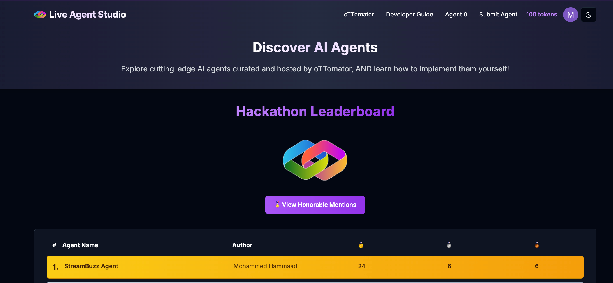
    <br />
    <b><a href="https://studio.ottomator.ai/hackathon/leaderboard">Hackathon Results</a></b>
</div>
<br />

A huge thanks to the **oTTomator team**, the amazing **global streamer community**, and everyone who voted and supported
this project! ❤️

---

## **Index**

1. [Intro](#your-ai-powered-youtube-live-stream-chat-moderator)
2. [Why StreamBuzz?](#why-streambuzz)
   - [The Solution](#the-solution)
   - [Usage](#usage)
   - [Benefits](#benefits)
   - [Features](#features)
3. [Getting Started](#getting-started)
   - [Clone](#clone)
   - [Configure](#configure)
   - [Run](#run)
4. [How to Contribute](#how-to-contribute)
5. [Roadmap](#project-roadmap)
6. [Demo & Architecture](#demo--architecture)
   - [Images](#images)
   - [Videos](#videos)
   - [Architecture Diagrams](#architecture-diagrams)
7. [Acknowledgments](#acknowledgments)

---

## **Your AI-powered YouTube Live Stream Chat Moderator**

**Attention Streamers!!**

Tired of drowning in a tsunami of chat messages while trying to present to your audience? StreamBuzz to the rescue! This
AI sidekick filters key messages, handles FAQs, and posts replies—so you can focus on being the rockstar streamer you
were born to be.

---

## **Why StreamBuzz?**

Live streaming is booming, with over **2 billion monthly YouTube users**. Streamers educate, entertain, and engage, but
juggling an avalanche of chat messages **while presenting** is like trying to play chess on a roller coaster. 🎢
Important questions, concerns, and requests get lost in the flood, making chat management feel impossible.

### **The Solution**

StreamBuzz **filters the noise, highlights key messages, and automates replies**, so you can engage without stress. No
more hunting through chat chaos—just smooth sailing! ⛵

<br />
<div style="text-align: center;">
    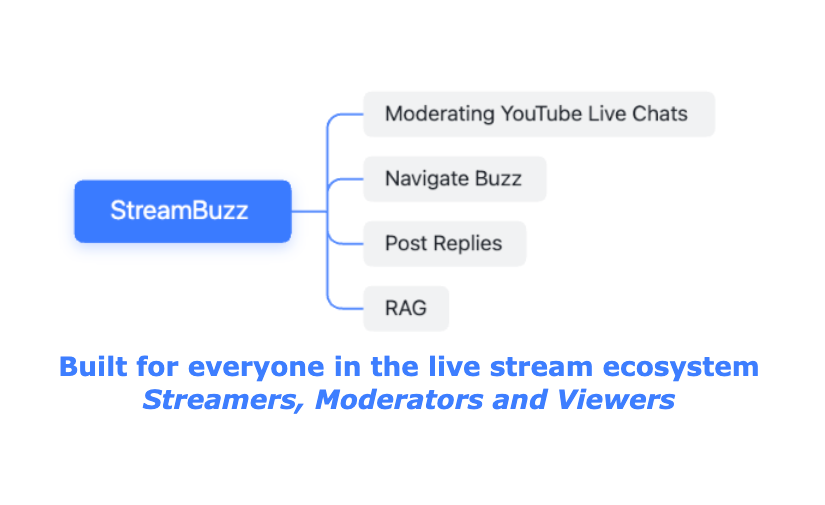
    <br />
    <b>StreamBuzz Features</b>
</div>
<br />

<br />
<div style="text-align: center;">
    <a href="https://www.youtube.com/watch?v=WkLXOjDoirg">
        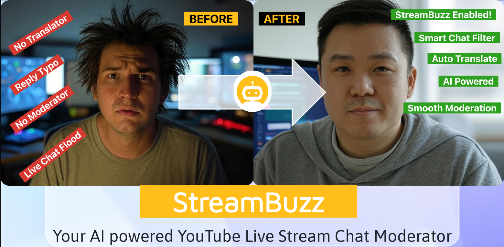
    </a>
    <br />
    <b>Click the thumbnail to watch the demo on YouTube! 🚀</b>
</div>
<br />

---

### *Meme Break #1* 😆

<br />
<div style="text-align: center;">
    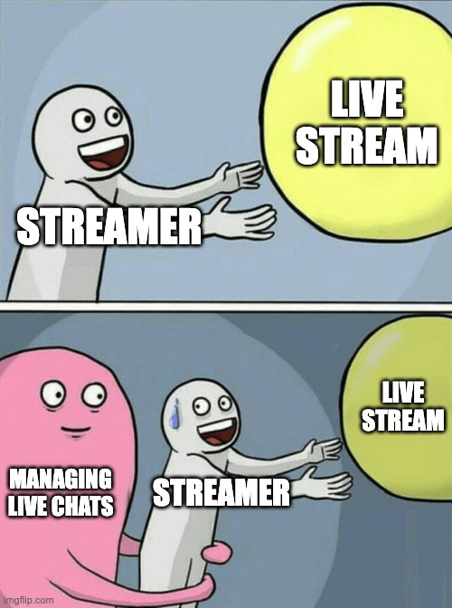
</div>
<br />

---

### **Usage**

1. Go to Live Agent Studio to try [StreamBuzz](https://studio.ottomator.ai/agent/streambuzz)
2. Pick a YouTube Live Stream and send it to StreamBuzz, to get started.
3. StreamBuzz filters and prioritizes chat messages (buzz) in the background.
   - StreamBuzz intelligently processes multilingual chats, too.
4. Navigate through the **real-time buzz list** using natural language.
   - With sentences like, `get current buzz` or `get next buzz`.
5. Post replies **directly from the chat interface**—error-free and neatly summarized.
   - StreamBuzz background worker takes care of correcting typos, summarizing and posting your replies.
6. Upload a text file to build a knowledge base and supercharge your responses. ⚡️

> ***All in all, StreamBuzz is the ultimate **companion and chat moderator** to supercharge your YouTube Live Streaming
experience.***

---

### **Benefits**

**🎯 Focus on Content** – Let StreamBuzz handle chat while you do your thing.\
**🔍 Better Engagement** – Important questions, concerns, and requests **stand out**.\
**⏳ Saves Time** – Generates replies for buzz (important messages), reducing your mental load.\
**🛠️ Customizable** – Update your knowledge base, and StreamBuzz **adapts automatically**.\
**💬 Improves Viewer Experience** – Ensures timely, relevant, typo-free responses.

---

### **Features**

🔹 **AI Chat Moderation** – Extracts key messages (buzz) from an ocean of chat spam. Navigate buzz at your own pace.\
🔹 **Suggested Replies** – Auto-generates responses and allows customization via a text-based knowledge base.\
🔹 **RAG (Retrieval-Augmented Generation)** – Smarter responses for streamers and chat queries.\
🔹 **Seamless YouTube Integration** – Works directly with YouTube Live Chat **in real time**.

---

### *Meme Break #2* 😆

<br />
<div style="text-align: center;">
    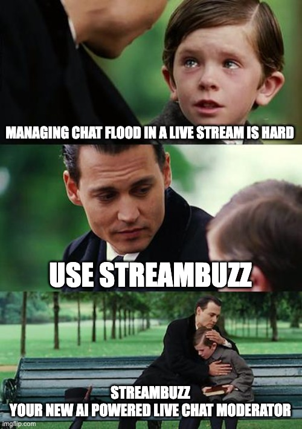
</div>
<br />

---

## **Getting Started**

### **Clone**

```bash
# Clone the repository
git clone https://github.com/hammaadworks/streambuzz.git
cd streambuzz

# Create a virtual environment (optional)
python -m venv .venv
source ./.venv/bin/activate

# Install dependencies
pip install -Ur requirements.txt
```

### **Configure**

1. Fill in your keys as specified in the `.env.example` file.
   - Use your model of choice by changing variables in `constants.py` under model section.
   - Paste your YouTube credentials in `.env` file as specified in `.env.example` file.
2. Create database tables using the DDL commands provided in `queries.sql` file.
3. Set up the user interface using **Agent 0 by Ottomator.ai** ([Agent 0](https://studio.ottomator.ai/agent/0)).

### **Run**

1. Set Environment Variable in `.env` file

   ```bash
   # Copy .env.example to .env and set your keys in .env file
   cp .env.example .env
   ```

2. Serve the FastAPI app

   ```bash
   fastapi-cli dev streambuzz.py --port 8001 --reload
   ```

   Alternatively, you can use `uvicorn`:

   ```bash
   uvicorn streambuzz:app --host 0.0.0.0 --port 8001
   ```

---

## **How to Contribute**

We welcome contributions from the community! If you'd like to improve StreamBuzz, follow these steps:

1. **Fork the Repository** – Start by forking the repo and creating a local clone.
2. **Create a New Branch** – Work on a feature or bug fix in a dedicated branch.
3. **Submit a Pull Request** – Once you're happy with your changes, open a PR with a clear description.
4. **Review & Merge** – Your PR will be reviewed, and if all looks good, it'll be merged into the main branch.

### **Ways to Contribute**

- Report bugs or suggest new features by opening an issue.
- Improve documentation to help others get started easily.
- Enhance the AI model to make chat moderation even smarter.
- Add new integrations or performance improvements.

Let's build a better streaming experience together! 🚀

---

## Project Roadmap

*Next up: More features, fewer bugs, full throttle! 🚀*

1. **Expanded YouTube Live URL Support**

   - **Priority:** High
   - **Effort Estimate:** XS
   - **Detail:**
     - YouTube has multiple URL formats for the same live stream.
     - Currently supports: `youtube.com/watch?v=<video_id>`
     - Need to extend validation to support multiple YouTube Live URL formats beyond
     `youtube.com/watch?v=<video_id>`.
     - Ensures seamless moderation across different YouTube link variations.

2. **Enhanced Buzz Navigation**

   - **Priority:** Medium
   - **Effort Estimate:** S
   - **Detail:**
     - Currently, only forward navigation is supported. 
     - Add support for reviewing and navigating previous buzz messages.
     - Implement shorthand navigation via `<`, `=`, `>` symbols for faster access.

3. **Multi-File RAG Support**

   - **Priority:** Medium
   - **Effort Estimate:** S
   - **Detail:**
     - Only one text file can be uploaded per session.
     - Extend support for multiple files and diverse formats.
     - Allow multiple files of different formats to be uploaded per session.

4. **Live Chat Reply for Subscriber-Only Streams**

   - **Priority:** High
   - **Effort Estimate:** M
   - **Detail:**
     - StreamBuzz cannot post replies if the stream requires subscribers-only chat.
     - Implement an auto-subscribe feature so StreamBuzz can participate in subscriber-only chats where moderation is currently restricted.

5. **OAuth Integration**

   - **Priority:** High
   - **Effort Estimate:** L
   - **Detail:**
     - Currently, replies are posted via the StreamBuzz Bot account.
     - Implement Google OAuth to allow streamers to post replies from their own accounts instead of the StreamBuzz Bot.
     - Improves authenticity and compliance.

6. **Multi-Stream Moderation Per Session**

   - **Priority:** Medium
   - **Effort Estimate:** L
   - **Detail:**
     - Currently, only one stream can be moderated per chat session.
     - Enable StreamBuzz to moderate multiple live streams simultaneously instead of being restricted to a single session.

7. **Multi-Platform Live Stream Support**
   - **Priority:** Low
   - **Effort Estimate:** XL
   - **Detail:**
     - StreamBuzz is limited to YouTube Live.
     - Extend StreamBuzz beyond YouTube to support Twitch, Facebook Live, and other popular streaming platforms.

---

### *Meme Break #3* 😆

<br />
<div style="text-align: center;">
    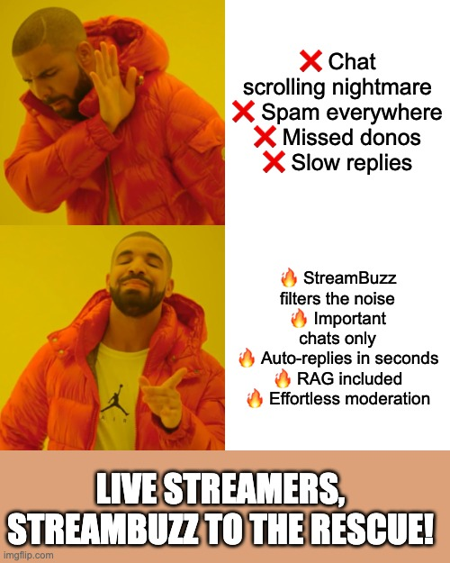
</div>
<br />

---

## **Demo & Architecture**

### **Images**

**1. Start chat moderation with ease.**
<div style="text-align: center;">
    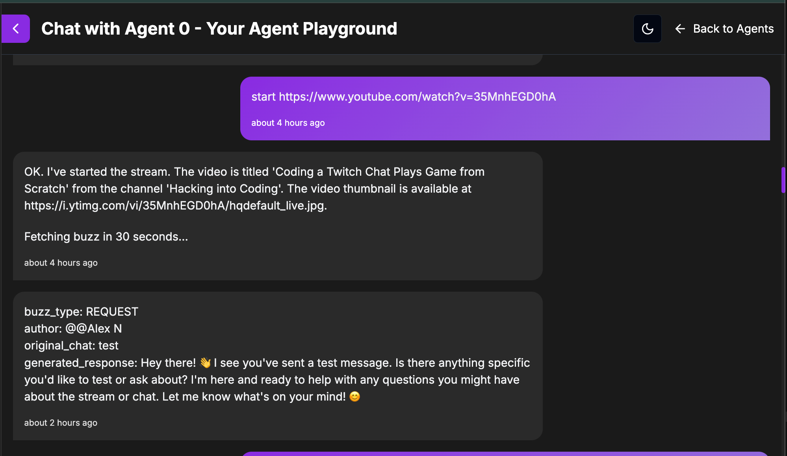
</div>
<br />

**2. Navigate through chat messages effortlessly.**
<div style="text-align: center;">
    
</div>
<br />

**3. Stay up to date with all key chats. 🎉**
<div style="text-align: center;">
    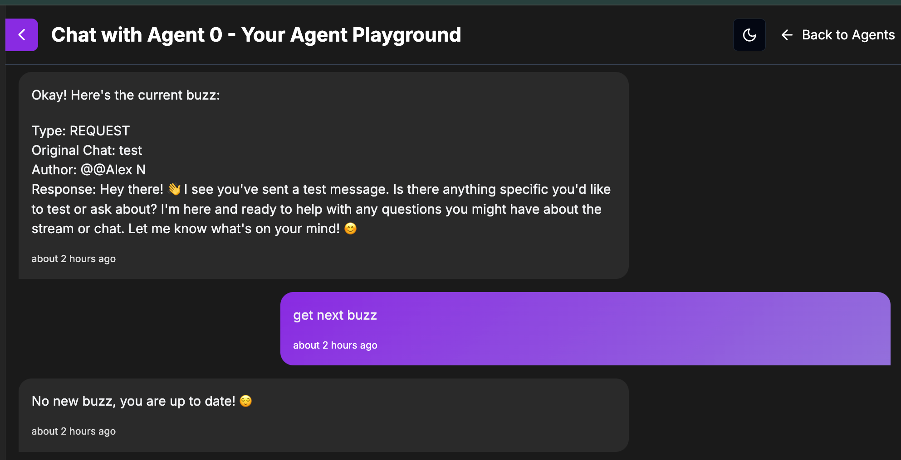
</div>
<br />

**4. Seamless reply integration with YouTube Live Chat.**
<div style="text-align: center;">
    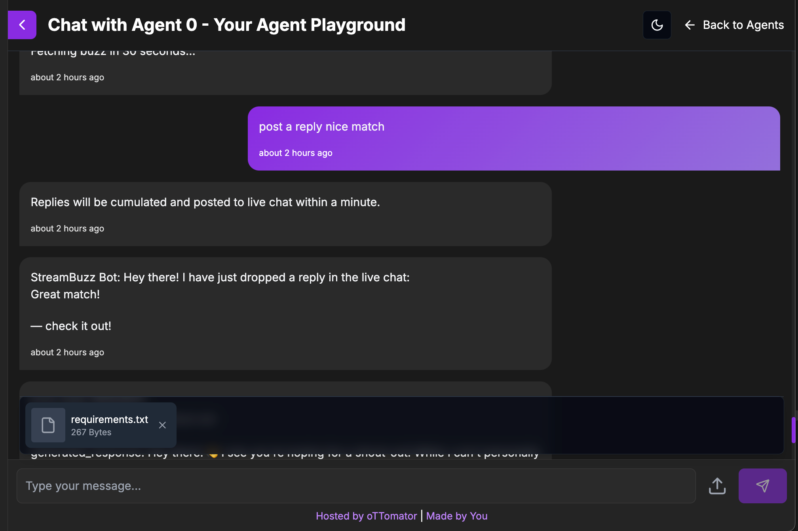
</div>
<br />

**5. Replies posted within a timeframe of 60 seconds on YouTube Live Chat.**
<div style="text-align: center;">
    
</div>
<br />

**6. RAG powered responses**
<div style="text-align: center;">
    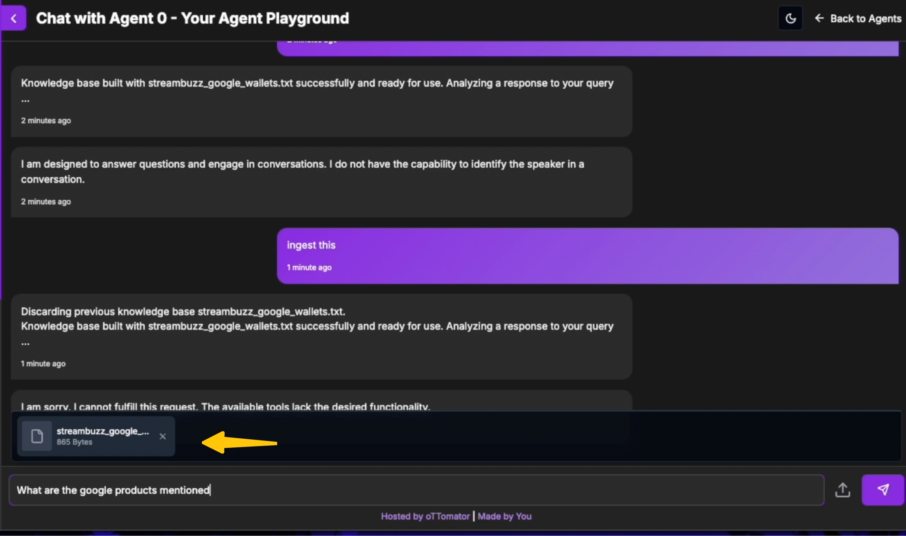
</div>
<br />

#### Videos

**1. StreamBuzz: Control Your Live Chat Like a Pro with AI! 🚀🔥**
<div style="text-align: center;">
    <a href="https://www.youtube.com/watch?v=TBflGeuoIP0">
    
    </a>
</div>
<br />

**2. StreamBuzz: AI-Powered Autocorrect & Smart Replies for Streamers! 🚀🔁️**
<div style="text-align: center;">
    <a href="https://www.youtube.com/watch?v=4cEXHcMMARk">
    
    </a>
</div>
<br />

**3. StreamBuzz: Agentic RAG on Custom Knowledge 🚀🎙️**
<div style="text-align: center;">
    <a href="https://www.youtube.com/watch?v=EAYflKOEAw4">
    
    </a>
</div>
<br />

**4. StreamBuzz: The Ultimate AI Chat Moderator for Live Streamers! 🚀🔥️**
<div style="text-align: center;">
    <a href="https://www.youtube.com/watch?v=WkLXOjDoirg">
    
    </a>
</div>
<br />

### **Architecture Diagrams**

<br />
<div style="text-align: center;">
    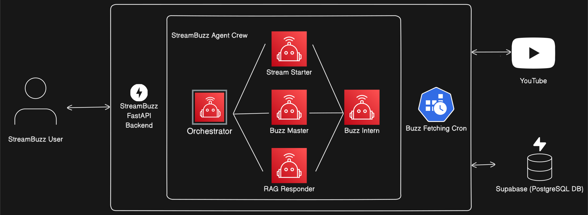
    <br />
    <b>StreamBuzz Architecture</b>
</div>
<br />

<br />
<div style="text-align: center;">
    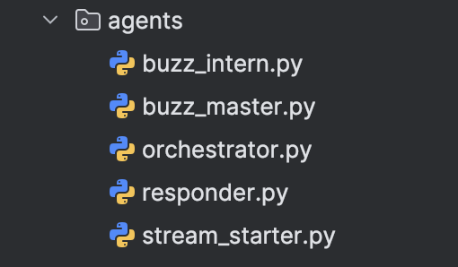
    <br />
    <b>A Moderator Crew of 5 Agents to your rescue!</b>
</div>
<br />

---

## **YouTube Channel & Playlist**

Check out my YouTube channel for tutorials, updates, and behind-the-scenes content:  
📺 **[My YouTube Channel](https://www.youtube.com/@hammaadworks)**

I’ve also put together a playlist showcasing StreamBuzz in action:  
▶️ **[StreamBuzz Playlist](https://www.youtube.com/playlist?list=PLakFdD-pYBdyFIoh72CStzPC3ppi4nAqV)**

---

## **Acknowledgments**

StreamBuzz was created as part of the **oTTomator Live Agent Studio Hackathon**.  
Huge shoutout to [**Cole Medin**](https://github.com/coleam00) and the [**Ottomator AI Team**](https://studio.ottomator.ai/)  
for hosting this incredible event and pushing the boundaries of AI-powered automation! 🎉

A massive thank you to the **open-source community** for their contributions, making cutting-edge technology accessible
to all.  
Special appreciation for projects like **[Pydantic AI](https://ai.pydantic.dev/)** and others,
your work makes innovations like StreamBuzz possible!

To all **content creators** who educate, share knowledge, and make resources more accessible—you are shaping the
future!  
Special mentions go to:

- 🎥 [**Cole Medin**](https://www.youtube.com/@ColeMedin) – Breaking down AI, automation, and building cool stuff.
- 🎥 [**Your Tech Bud Codes**](https://www.youtube.com/@YourTechBudCodes) – Making tech & coding easier for everyone.

---

### **Special Thanks to the Global Streamer Community** 🎙️✨

Most importantly, **a heartfelt thanks to the global streamer community**—the educators, entertainers, and innovators  
who make live streaming a hub of knowledge and engagement.

You inspire us to build tools that make your work easier and your content even better.  
**This is for you!** 🚀

---

## Hackathon Community Voting (Archived)

This section has been archived following the conclusion of the hackathon. Thank you for your support!

1. 🌟 **Visit Live Agent Studio** to explore [StreamBuzz](https://studio.ottomator.ai/agent/streambuzz) and a ton of
   other incredible agents!
2. 🎬 **Try out StreamBuzz**! Before diving in, please check out the [usage](#usage) section for the best experience,
   or simply watch the [demo video](https://youtu.be/7PgvglcWNNA) to get a quick overview.
3. ✅ **Cast your vote** for your favorite agents—I'm hoping that StreamBuzz is one of them! 🤩
4. 🤗 **Thank you so much** for your support! Your vote means a lot.

---
