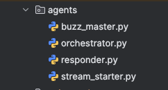
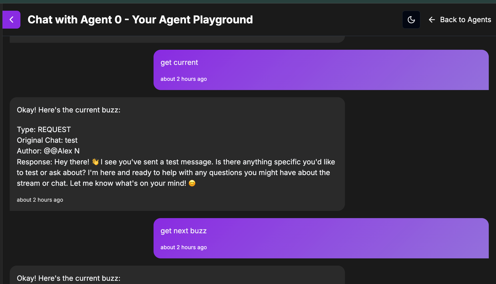
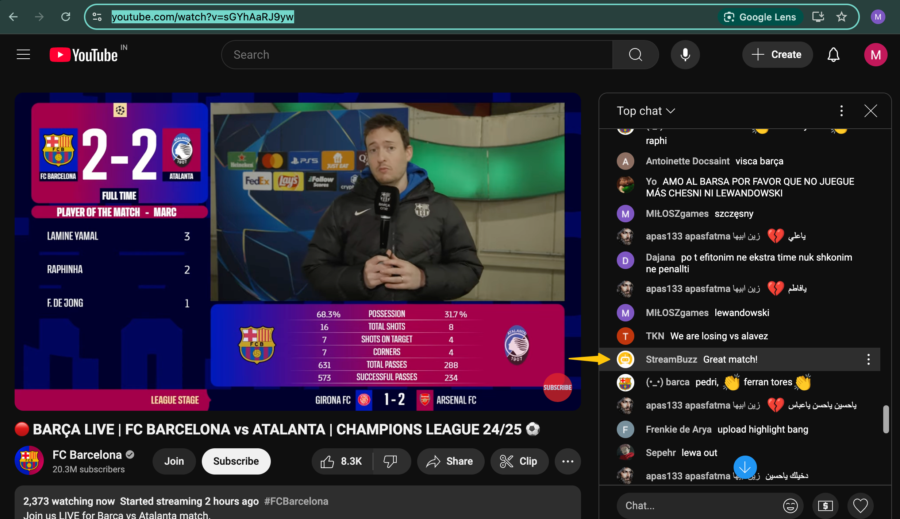

# StreamBuzz 🚀

**Your AI-powered YouTube Live Stream Chat Moderator**

Tired of drowning in a tsunami of chat messages while trying to entertain your audience? StreamBuzz to the rescue! This AI sidekick filters key messages, handles FAQs, and posts replies—so you can focus on being the rockstar streamer you were born to be.

## Why StreamBuzz?
Live streaming is booming, with over **2 billion monthly YouTube users**. Streamers educate, entertain, and engage, but juggling an avalanche of chat messages **while presenting** is like trying to play chess on a roller coaster. 🎢 Important questions, concerns, and requests get lost in the flood, making chat management feel impossible.

### The Solution
StreamBuzz **filters the noise, highlights key messages, and automates replies**, so you can engage without stress. No more hunting through chat chaos—just smooth sailing! ⛵

### Benefits
- **🎯 Focus on Content** – Let StreamBuzz handle chat while you do your thing.
- **🔍 Better Engagement** – Important questions, concerns, and requests **stand out**.
- **⏳ Saves Time** – Generates replies for buzz (important messages), reducing your mental load.
- **🛠️ Customizable** – Update your knowledge base, and StreamBuzz **adapts automatically**.
- **💬 Improves Viewer Experience** – Ensures timely, relevant, typo-free responses.

## Features
- **🧠 AI Chat Moderation** – Extracts key messages (buzz) from an ocean of chat spam. Navigate buzz at your own pace.
- **💡 Suggested Replies** – Auto-generates responses and allows customization via a text-based knowledge base.
- **📚 RAG (Retrieval-Augmented Generation)** – Smarter responses for streamers and chat queries.
- **🔗 Seamless YouTube Integration** – Works directly with YouTube Live Chat **in real time**.

## Getting Started

### Installation
```bash
# Clone the repository
git clone https://github.com/hammaadworks/streambuzz.git
cd streambuzz

# Install dependencies
pip install -Ur requirements.txt
```
Alternatively, build an image from the Dockerfile and save yourself the setup hassle. 🏗️

### Configuration
1. Fill in your keys as specified in the `.env.example` file.
2. Create database tables using the DDL commands provided in `queries.sql`.
3. Set up the user interface using **Agent 0 by Ottomator.ai** ([Agent 0](https://studio.ottomator.ai/agent/0)).

### Running StreamBuzz
```bash
fastapi-cli dev streambuzz.py --port 8001 --reload
```
Alternatively, use Uvicorn:
```bash
uvicorn streambuzz:app --host 0.0.0.0 --port 8001
```

## Usage
- Start a YouTube Live Stream.
- StreamBuzz filters and prioritizes chat messages (buzz).
- Navigate through the **real-time buzz list** like a pro.
- Post replies **directly from the chat interface**—error-free and neatly summarized.
- Upload a text file to build a knowledge base and supercharge your responses. ⚡

All in all, StreamBuzz is the ultimate **companion and chat moderator** for YouTube Live Streamers. Think of it as your chat butler. 🧐☕

## Architecture & Product Demos
### Architecture Diagrams
*A Moderator Crew of 4 Agents to your rescue!*


## Demo Gallery
Here’s a closer look at StreamBuzz in action:

  
*1. Staring chat moderation on StreamBuzz*

  
*2. Chat navigation on StreamBuzz*

  
*3. Up to date with all useful chats - A Streamer's dream come true. 🎉*

  
*4. Seamless integration of replies with YouTube Live Chat.*

  
*5. Reply posted on YouTube Live Chat by StreamBuzz*


## Acknowledgments
StreamBuzz was created as part of the **oTTomator Live Agent Studio Hackathon**. Huge shoutout to the **Ottomator AI Team** for hosting this incredible event and pushing the boundaries of AI-powered automation! 🎉

And of course, massive thanks to the global streamer community for making live streaming a hub of education, entertainment, and engagement. **You inspire us!** 🚀

